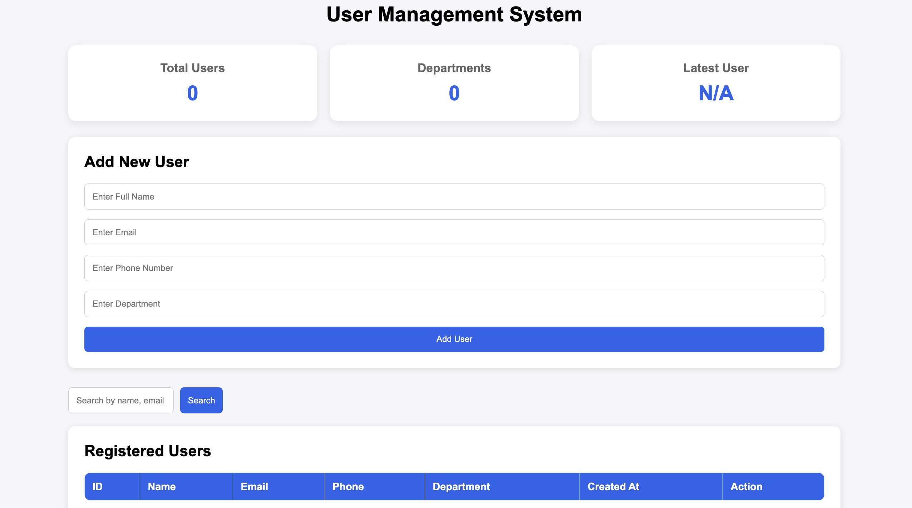
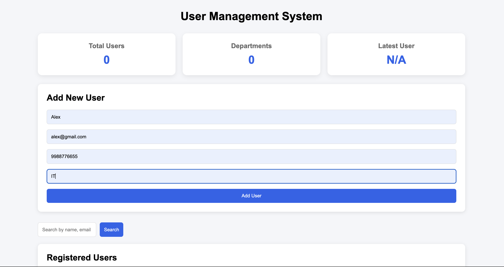
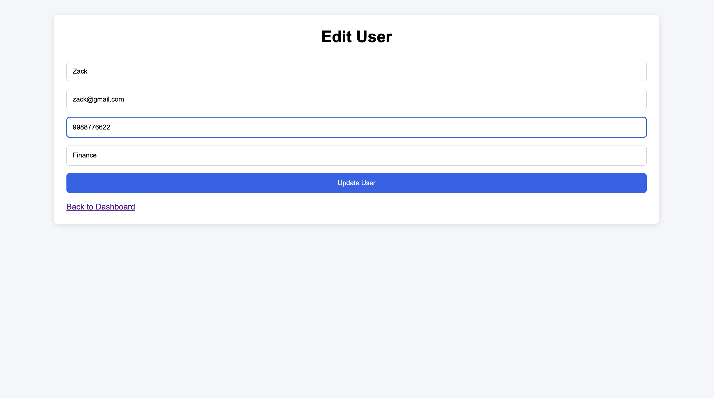
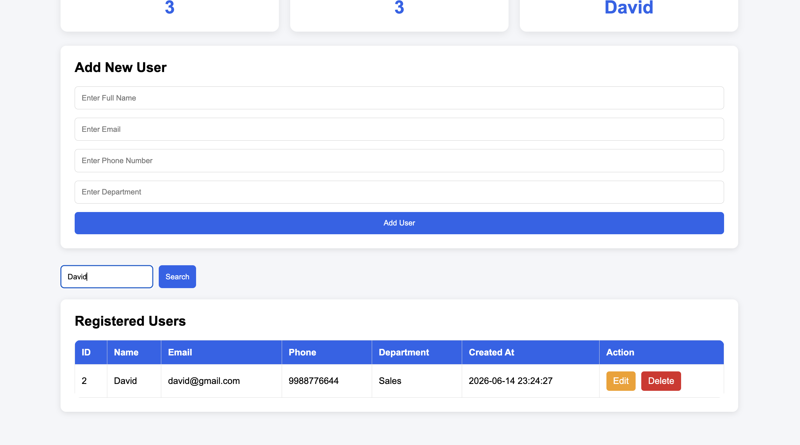

# User Management System

A Flask-based User Management System developed as part of the Maincrafts Technology Python Full Stack Web Development Internship.

## Project Overview

This project demonstrates the integration of frontend, backend, and database technologies to create a complete full-stack web application.

The application allows users to:

* Add new users
* View all registered users
* Edit existing user details
* Delete users
* Search users
* Store data permanently using SQLite

The project follows the CRUD (Create, Read, Update, Delete) architecture commonly used in modern web applications.

---

## Features

### User Management

* Add new users
* View registered users
* Update user information
* Delete users

### Search Functionality

* Search users by:

  * Name
  * Email
  * Department

### Dashboard Statistics

* Total Users
* Total Departments
* Latest Registered User

### User Notifications

* Success messages when users are added
* Success messages when users are updated
* Success messages when users are deleted

### Database Integration

* SQLite database
* Persistent data storage
* Automatic database initialization

---

## Technology Stack

### Backend

* Python
* Flask

### Frontend

* HTML5
* CSS3
* Jinja2 Templates

### Database

* SQLite

### Development Tools

* Visual Studio Code
* Git
* GitHub

---

## Project Structure

```text
maincrafts-python-fullstack-internship/
│
├── app.py
├── database.db
├── README.md
├── requirements.txt
│
├── templates/
│   ├── index.html
│   └── edit_user.html
│
├── static/
│   └── style.css
│
└── screenshots/
```

---

## Installation

### Clone Repository

```bash
git clone <repository-url>
cd maincrafts-python-fullstack-internship
```

### Install Dependencies

```bash
pip install flask
```

### Run Application

```bash
python app.py
```

### Open Browser

```text
http://127.0.0.1:5000
```

---

## Application Workflow

1. User enters details through the web form.
2. Flask receives the form submission.
3. Data is stored in the SQLite database.
4. Stored users are displayed in the dashboard table.
5. Users can search, edit, and delete records.
6. Dashboard statistics update automatically.

---

## Screenshots

### Dashboard



### Add User



### Edit User



### Search User



---

## Learning Outcomes

Through this project, I learned:

* Flask application development
* Routing and request handling
* HTML template rendering using Jinja2
* SQLite database integration
* CRUD operations
* Form handling and validation
* Git and GitHub workflow
* Version control best practices
* Full Stack Web Development fundamentals

---

## Internship Information

**Organization:** Maincrafts Technology

**Internship Program:** Python Full Stack Web Development

**Task:** User Management Web Application

**Duration:** 14 June 2026 – 14 July 2026

---

## Author

Mohd Aaman

GitHub: https://github.com/mohdaaman
