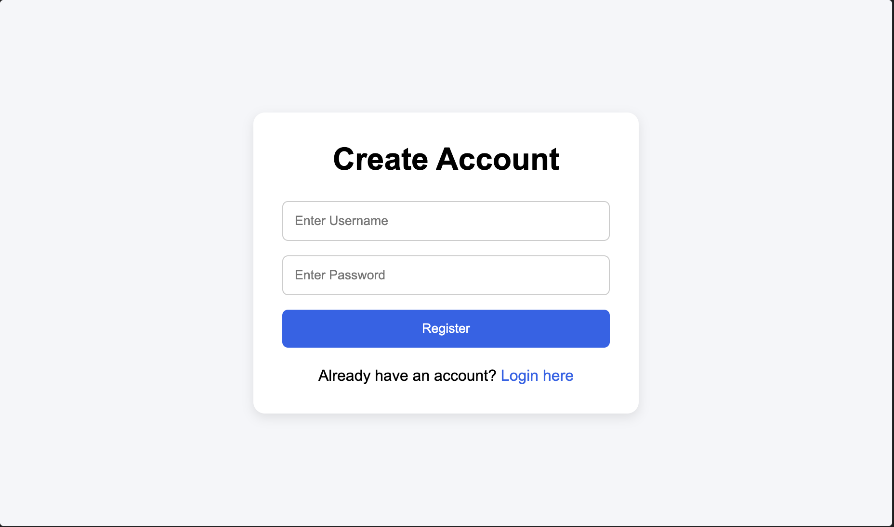
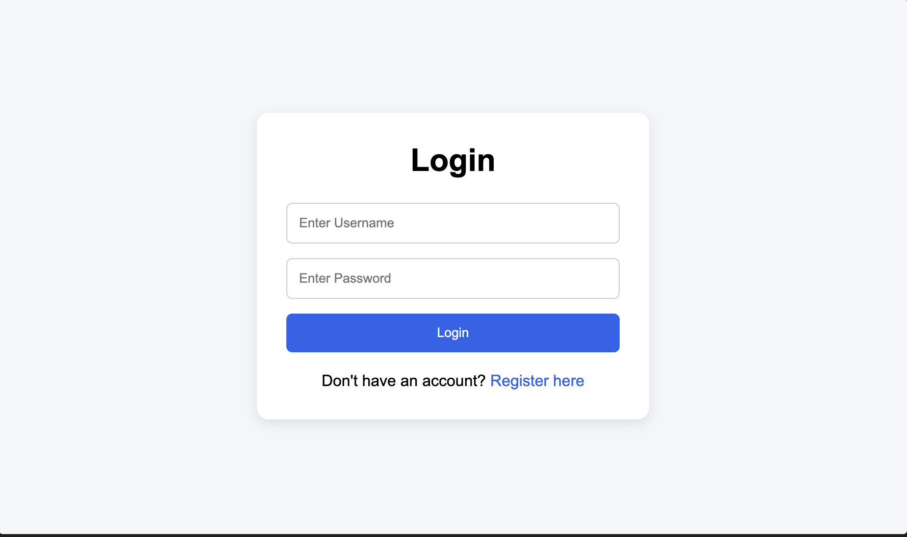
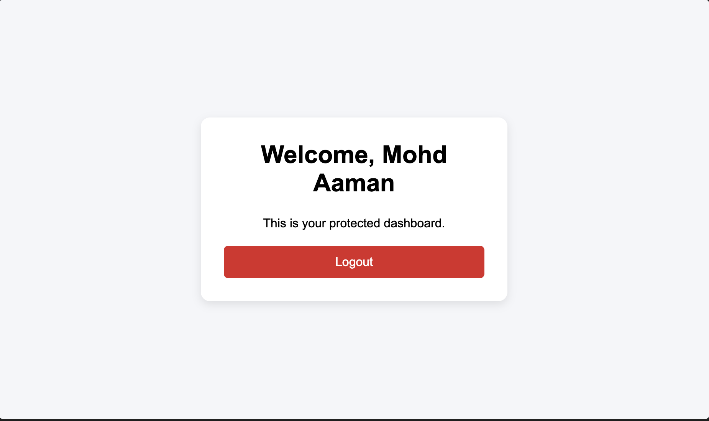

# User Authentication System

A Flask-based User Authentication System developed as part of the Maincrafts Technology Python Full Stack Web Development Internship (Task 2).

## Project Overview

This project demonstrates the implementation of a secure authentication system using Flask, SQLite, and session management.

The system allows users to:

* Register new accounts
* Login securely
* Access protected dashboard routes
* Logout safely

Passwords are stored securely using hashing techniques.

---

## Features

* User Registration
* Password Hashing
* User Login
* Session Management
* Protected Dashboard Access
* Logout System
* Flash Notifications

---

## Technology Stack

### Backend

* Python
* Flask

### Frontend

* HTML5
* CSS3
* Jinja2 Templates

### Database

* SQLite

### Security

* Werkzeug Password Hashing
* Flask Sessions

---

## Project Structure

```text
task-2/
├── app.py
├── database.db
├── README.md
├── requirements.txt
├── templates/
│   ├── register.html
│   ├── login.html
│   └── dashboard.html
├── static/
│   └── style.css
└── screenshots/
```

---

## Authentication Flow

1. User registers an account.
2. Password is hashed before storing.
3. User logs in using credentials.
4. Flask verifies password hash.
5. Session is created after successful login.
6. Dashboard becomes accessible.
7. Logout destroys the session.

---

## Security Features

* Password hashing
* Session protection
* Protected routes
* Duplicate username prevention

---

## Learning Outcomes

Through this project, I learned:

* Flask Authentication
* Password Hashing
* Session Handling
* Protected Routes
* User Authentication Workflow
* Secure Web Development Basics

---

## Internship Information

**Organization:** Maincrafts Technology

**Task:** Task 2 – User Authentication System

**Duration:** 14 June 2026 – 14 July 2026

## Screenshots

### Registration Page



---

### Login Page



---

### Dashboard Page

