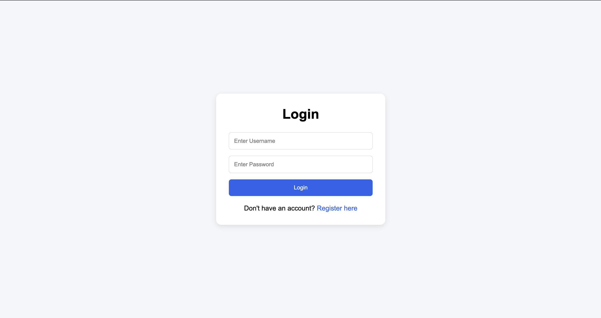
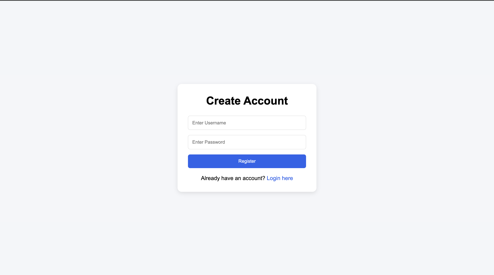
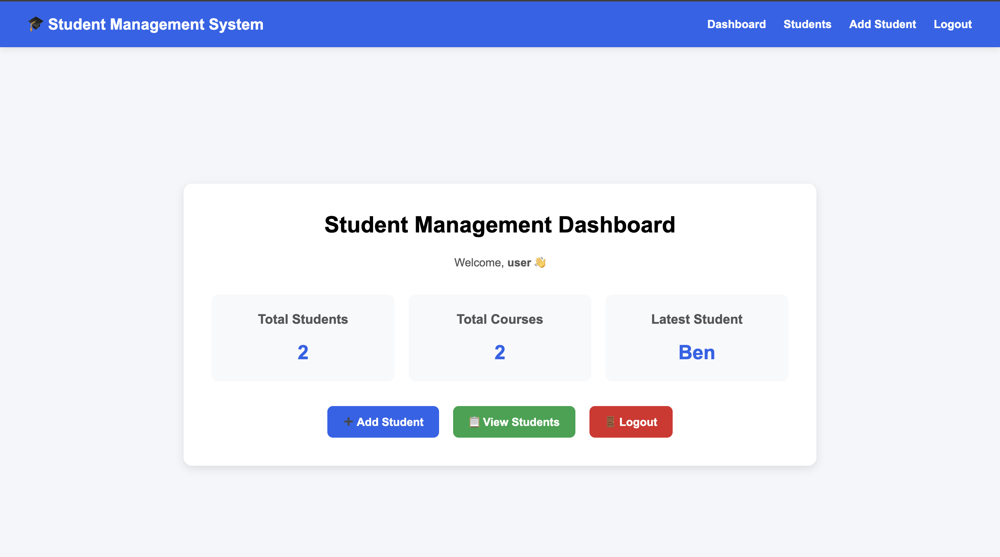
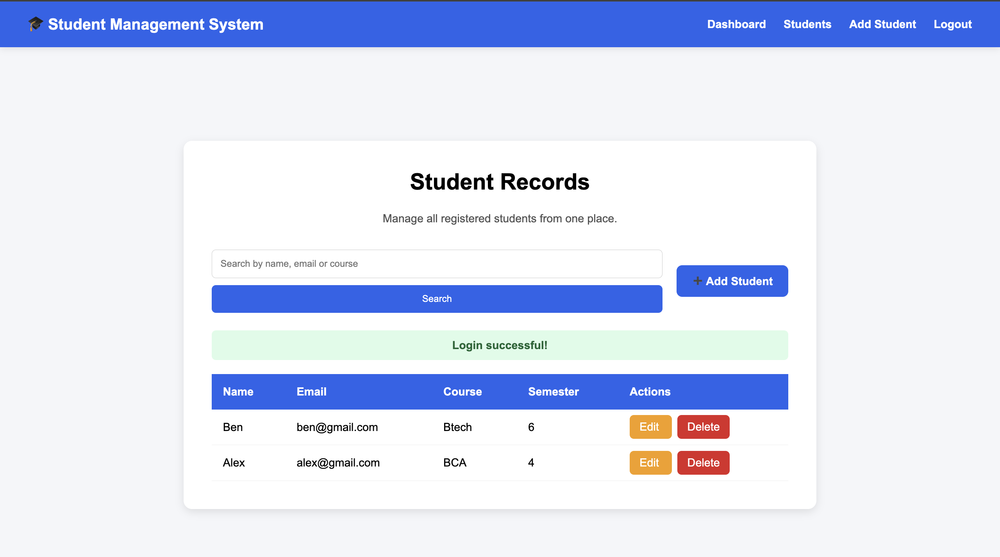
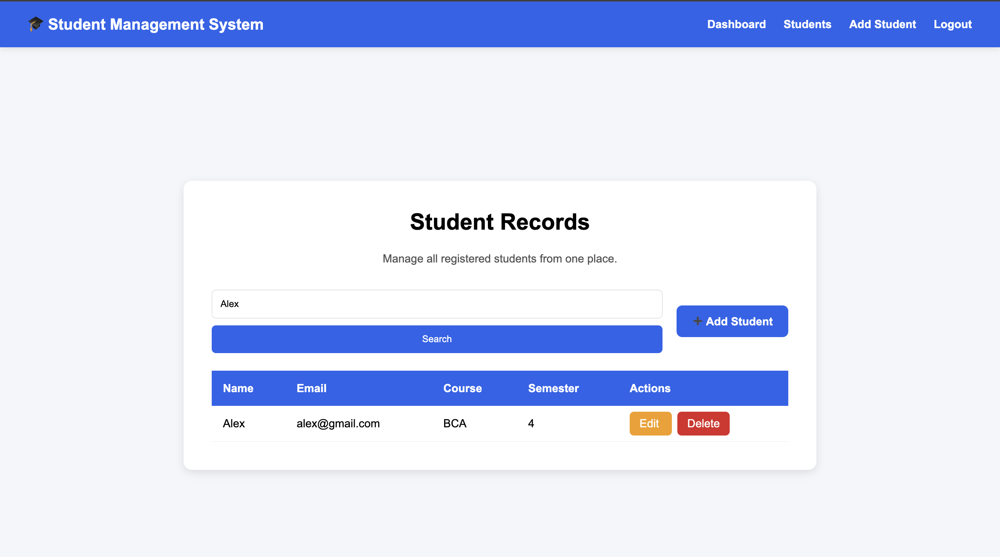
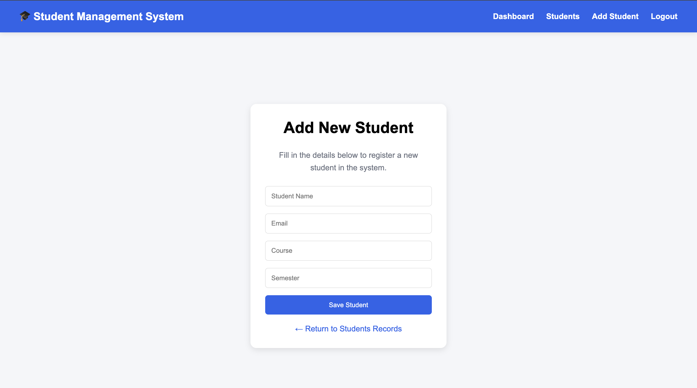
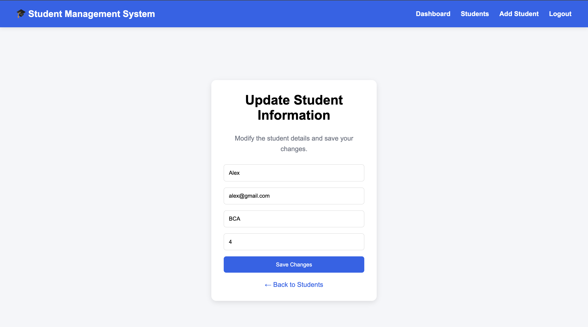

# Student Management System

A Flask-based Student Management System developed as part of **Task 3** of the Maincrafts Technology Python Full Stack Web Development Internship.

## Project Overview

This project extends the authentication system developed in Task 2 by integrating a complete database-driven CRUD module for authenticated users.

The application allows authorized users to securely manage student records through a clean and responsive web interface.

---

## Features

### Authentication

* User Registration
* Secure Login
* Logout
* Password Hashing
* Session Management
* Protected Routes

### Student Management

* Add Student
* View Students
* Edit Student
* Delete Student
* Search Students

### Dashboard

* Total Students
* Total Courses
* Latest Student
* Navigation Dashboard

### User Experience

* Flash Messages
* Responsive Design
* Reusable Navbar
* Modern Dashboard
* Professional Table Layout

---

## Technology Stack

### Backend

* Python
* Flask

### Frontend

* HTML5
* CSS3
* Jinja2 Templates

### Database

* SQLite

### Security

* Werkzeug Password Hashing
* Flask Sessions

### Development Tools

* Visual Studio Code
* Git
* GitHub

---

## Project Structure

```text
task-3/
│
├── app.py
├── database.db
├── README.md
├── requirements.txt
│
├── templates/
│   ├── navbar.html
│   ├── login.html
│   ├── register.html
│   ├── dashboard.html
│   ├── students.html
│   ├── add_student.html
│   └── edit_student.html
│
├── static/
│   └── style.css
│
└── screenshots/
```

---

## Application Workflow

1. User registers an account.
2. Password is securely hashed and stored.
3. User logs in using valid credentials.
4. A session is created after successful authentication.
5. The user accesses the dashboard.
6. Student records can be created, viewed, updated, searched, and deleted.
7. Logout destroys the active session.

---

## Security Features

* Password Hashing
* Session-Based Authentication
* Protected Routes
* Duplicate Username Validation

---

## Learning Outcomes

Through this project, I learned:

* Authentication using Flask Sessions
* Password Hashing with Werkzeug
* SQLite CRUD Operations
* Search Functionality
* Jinja2 Template Reusability
* Dashboard Development
* Responsive UI Design
* Full Stack Application Development

---

## Internship Information

**Organization:** Maincrafts Technology

**Internship:** Python Full Stack Web Development

**Task:** Task 3 – Database-Driven CRUD Application with Authentication

**Duration:** 14 June 2026 – 14 July 2026


# Application Preview

## Authentication

### Login



### Registration



---

## Dashboard



---

## Student Management

### Student Records



### Search Functionality



### Add Student



### Edit Student

